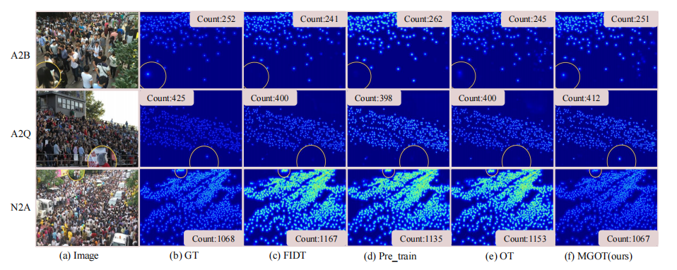

# Multi-Granularity Distribution Alignment for Cross-Domain Crowd Counting
## News
[[Project page](https://github.com/HopooLinZ/MGOT)] [[paper]()]   
An officical implementation of "Multi-Granularity Distribution Alignment for Cross-Domain Crowd Counting" (Accepted by TIP 2025).   
We propose a novel domain adaption method named MGOT,aligning dsitributions at multi-granularities to bridge the source-target domain gap.
## Overview
Overview of proposed MGOT framework, consisting of three key modules. First, pre-trained crowd counting models φ
s and φt0 (which can be replaced with any density-map-based counting model) are applied to source and target patches to capture the fine-grained distribution in both domains. These distributions are then clustered based on similarity. Second, a multi-granularity domain alignment module using OT aligns the source and target domains from coarse to fine. Finally, a re-weighting strategy evaluates the alignment and fine-tunes φt0 to obtain the optimal target model, φt.

# Visualizations
Visualization results in cross-domain setting involving A2B, A2Q and N2A.

# Environment
  you can see requirements.txt for details.

# How to train

> #### The model is trained within two stages. 
1. Retrain the model with pseudo lables
    + we follow [DAOT](https://github.com/HopooLinZ/DAOT) to retrain the target model to obtain φt0.

2. FineTune the model with source patches selected by OT
    +  we follow [DAOT](https://github.com/HopooLinZ/DAOT) to obtain distribution of source and target domain.
    +  run `k_means_elbow.py` and `k_means.py`to get the cluster-based distribution of source and target domain. 
    +  run `k_means_ot_weight.py` to align source and target domain patches at multi-granularties.
    +  run `python train_baseline_weight.py `to finetune φt0 and obtain final φt. The baseline we use is [[FIDT](https://github.com/dk-liang/FIDTM)], and you can change the baseline if you want.

